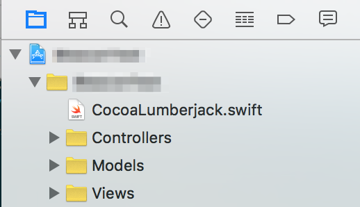
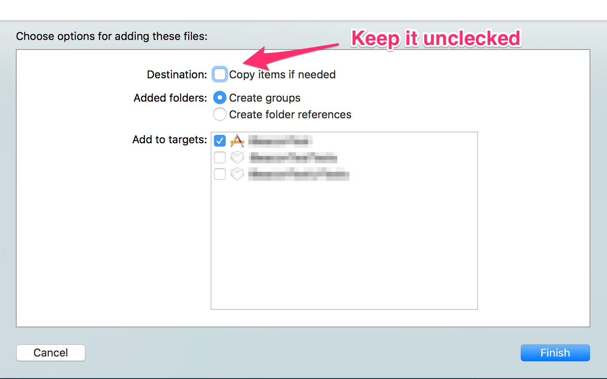

# CocoaLumberJack-Swift_2_Wrapper
Modidfy the official wapper to support Swift 2.0

## How to use CocoaLumberJack as a static library in a project written in Swift 2.0

### 1. Install the official one with Cocoapods 
	pod 'CocoaLumberjack'

### 2. Replace the official wapper with this one
	path-to-project-dir/Pods/CocoaLumberjack/Classes/CocoaLumberjack.swift

### 3. Add these two headers into your bridge header file
```swift
	#import "CocoaLumberjack.h"
	#import "DDMultiFormatter.h"
```
### 5. Add `CocoaLumberjack.swift` into your project



### 6. Initialize the logger
```swift
	func application(application: UIApplication, didFinishLaunchingWithOptions launchOptions: [NSObject: AnyObject]?) -> Bool {
        // Override point for customization after application launch.
        // Initialize the logger
        defaultDebugLevel = DDLogLevel.Verbose    
    	DDLog.addLogger(DDASLLogger.sharedInstance())
    	DDLog.addLogger(DDTTYLogger.sharedInstance())
        return true
    }
```

### 7. Enjoy
```swift
	func logSomething() {
    	DDLogVerbose("Verbose");
    	DDLogDebug("Debug");
    	DDLogInfo("Info");
    	DDLogWarn("Warn");
    	DDLogError("Error");	
	}
```